<p>
  
</p>

# Cinemax

#### Autores:
- Jorge Cárdenas Cárdenas
- Ricardo Antonio Hernández Torres
- Samuel Arturo Garrido Sánchez

## Modelo 3 + 1
El modelo “4+1” es una descripción de arquitecturas de software recomendado el estándar “IEEE 1471-2000” (Recommended Practice for Architecture Description of Software-Intensive Systems) para documentar sistemas de información haciendo uso de múltiples puntos de vista.

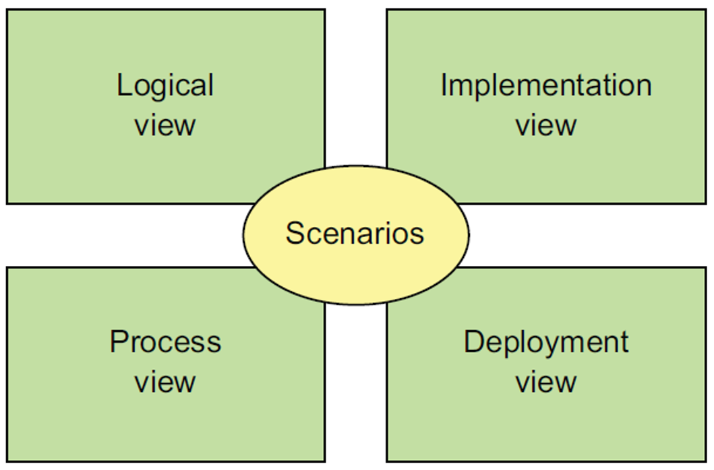

A continuación, se describe el diseño de cada vista para el sistema de información “Cinemax”.

### Vista Lógica
Esta vista consta de los elementos de software que son creados por los programadores, para lo que se consideran los siguientes puntos:

####	Arquitectura de Software
El sistema de información está diseñado siguiendo los principios de una arquitectura hexagonal (también conocida como arquitectura de puertos y adaptadores). Esta arquitectura permite que el dominio de la aplicación se encuentre totalmente aislado del exterior, incluyendo el cliente, la infraestructura del servidor y la capa de persistencia, así como otras interacciones. Así mismo, el uso de esta arquitectura permite que la lógica de la aplicación (el desarrollo de los casos de uso) no dependan de una implementación especifica de los métodos de acceso a datos, sino exclusivamente de la firma de estos.

Dentro de esta arquitectura, los puertos definen el conjunto de operaciones e interacciones de la lógica empresarial con lo que se encuentra fuera de ellas (APIS externas, y bases de datos), dentro del paradigma orientado a objetos se implementan mediante interfaces. Los adaptadores a su vez definen la implementación concreta de los puertos, manejando solicitudes desde el exterior que invocan la lógica de negocios, o invocación por parte de la lógica empresarial hacia aplicaciones externas; en programación orientada a objetos se crean como clases que implementan las interfaces definidas por los puertos.

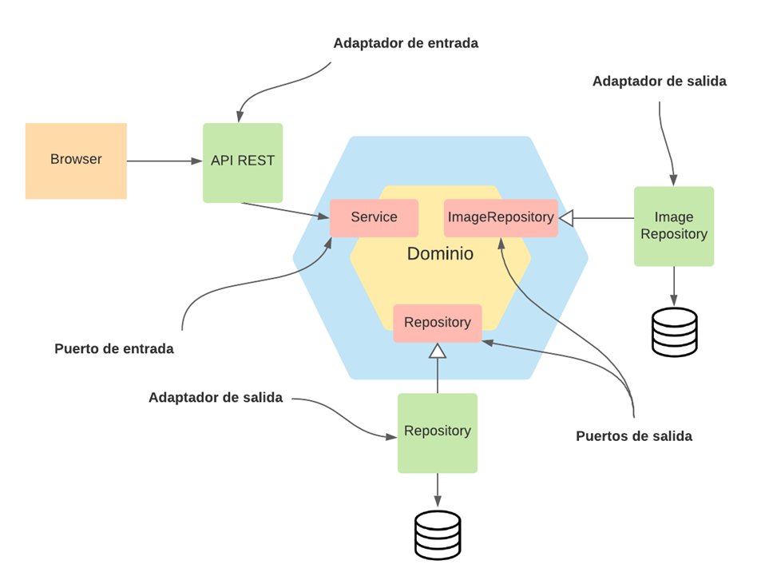

El adaptador de entrada consiste en la implementación de un API REST en formato JSON, mientras que el adaptador de salida en una clase que utiliza el patrón Respository para el acceso a la base de datos.

#### Diagramas de clases
Por un lado, se tiene el diagrama de Clases de la arquitectura (puertos y adaptadores), que muestra el orden de la inyección de dependencias:

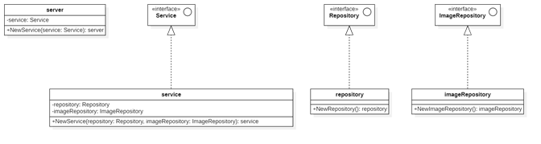

**Nota**: Por cuestiones de legibilidad en el diagrama, no se incluyen las firmas de los métodos dentro de las interfaces, sin embargo, se debe entender que la interface Service define los métodos asociados de cada uso; mientras que las interfaces Repository definen las firmas necesarias para interactuar con las capas de persistencia.

Por otra parte, el diagrama de clases correspondiente a los objetos que integran del dominio es el siguiente:

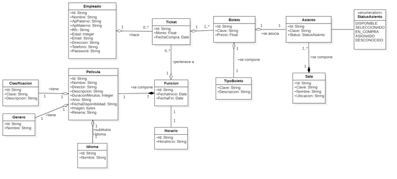

#### Modelo relacional


### Vista de Desarrollo
Esta vista se centra en los entornos de desarrollo, bibliotecas, frameworks y el cómo se organizan los artefactos de desarrollo en el sistema de archivos.

#### Entorno de desarrollo

- **Golang**

El backend, está desarrollando en lenguaje Golang, un lenguaje compilado de código abierto desarrollado por Google, en su versión 1.17. El lenguaje resulta perfecto dadas no solo sus características sintácticas, que lo hacen conciso, explicito y fácil de leer; sino por su alta eficiencia (equiparable con la del lenguaje C) que lo hacen idóneo para funcionar en sistemas de cómputo en la nube, sistemas de misión crítica, y en general en cualquier sistema; así como su soporte nativo para la concurrencia mediante gorutines.

Go ha mostrado tener gran aceptación por parte de la comunidad de desarrolladores, lo que lo ha convertido en uno de los lenguajes que está creciendo mucho más rápido que cualquier otro. En este aspecto, existe también una gran cantidad de frameworks y bibliotecas que facilitan en gran medida la creación de servidores Web. Otro aspecto en consideración al elegir Go como lenguaje de programación de backend, es la poca cantidad de memoria que demandan las aplicaciones, ya que mientras frameworks como Spring Boot con Java requieren alrededor de 500 MB solo para iniciar, un servidor en Go no requiere más de 20 MB.

De entre los muchos frameworks disponibles para la creación de sistemas API REST, esta versión del sistema utiliza Gin v1.7.3, un framework minimalista para web que utiliza httprouter (la biblioteca nativa del lenguaje Go para la creación de servidores http), que lo convierte en un framework de alto rendimiento y productividad.

- **VueJS**

El frontend está diseñado con el framework progresivo VueJS de JavaScript, en su versión 2.0. VueJS ofrece una gran experiencia al usuario, mantiene una curva de aprendizaje simple, es flexible para desarrollar muchos tipos de proyectos, como single page applications (SPA) o Progressive Web App (PWA); así mismo, VueJS ofrece un mejor rendimiento inclusive mayor que otras alternativas de frameworks populares. Lo anterior hace de VueJS, un framework muy potente y de fácil desarrollo para la creación del frontend del sistema.

- **PostgreSQL**

El sistema utiliza el manejador de bases de datos PostgreSQL en su versión 14.1. Se eligió PostgreSQL por ser un sistema gestor de bases de datos relacionales Open Source multiplataforma y capaz de trabajar con proyectos grandes sin aumentar su complejidad, PostgreSQL ofrece alta disponibilidad, consistente y tolerancia a fallos. Además, el hecho de soportar alta concurrencia, seguridad e integridad referencial lo hace idóneo para las características del sistema.

- **NGINX**

Según la propia documentación de Vue.js, cuando se trata de servir una aplicación en producción resulta más conveniente considerar un servidor como NGINX o Apache. Nginx, es un servidor web opensource y multiplataforma que ha conseguido mucha más eficiencia en el consumo de recursos y en la velocidad de respuesta al servir contenidos. Su principal ventaja como servidor web es que consume muchos menos recursos al servir contenido estático, lo que lo convierte en una excelente opción para funcionar como proxy inverso o como balanceador de carga para optimizar la entrega de contenidos.

En consideración con lo anterior, el compilado del cliente o frontend de Cinemax se encuentra montado sobre un servidor Nginx, que a su vez se encuentra dentro de una imagen Docker.

-	**Docker**

Docker es una herramienta de código abierto que automatiza el despliegue de aplicaciones en contenedores virtuales. Gracias a Docker se puede ejecutar y utilizar software sin tener que instalarlo directamente en los entornos de desarrollo; así mismo facilita el despliegue en producción.

-	**Git**

Git es un software de control de versiones distribuido que, junto con GitHub, permite alojar proyectos online, dando a los desarrolladores la oportunidad de colaborar a la par en el desarrollo de un mismo proyecto.

#### Arquitectura 
Respecto a la arquitectura, se trata de una arquitectura monolítica del estilo cliente-servidor dividida en backend (la parte del servidor) y frontend (el sitio web). Al mantenerlos de forma independiente se gana flexibilidad a la hora de desarrollar, es decir, el equipo de desarrollo se puede dividir para trabajar tanto en el frontend como en el backend a la vez. Así mismo, esta división permite la evolución del sistema hacia dispositivos móviles sin tener que reescribir el backend.

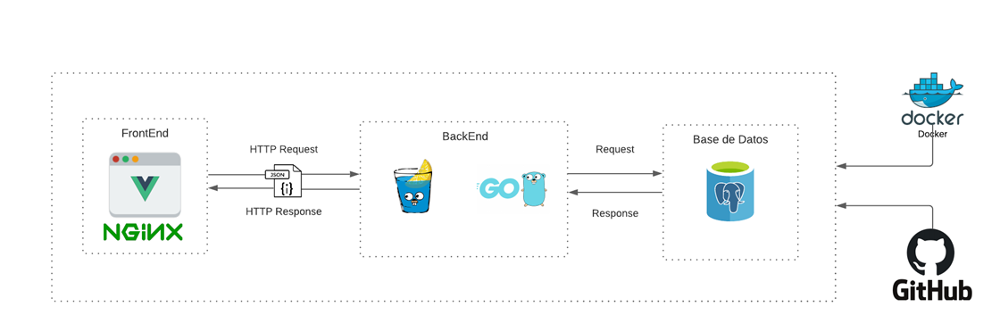

#### Sistema de Archivos
La estructura de archivos del backend es el siguiente. Dentro de la carpeta internal se encuentran las carpetas con cada elemento que integra a la arquitectura hexagonal (puertos, adaptadores, dominio y aplicación). La carpeta db contiene la definición de los modelos en sql (código DDL) y los datos de carga inicial, como los son los catálogos, status, los asientos y salas del cine, precio de los boletos, etc.

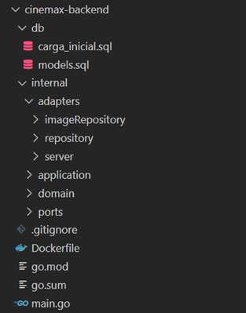

Por su parte, la estructura del proyecto en el frontend corresponde con la de cualquier proyecto de Node.js. Respecto a la organización interna del directorio src se siguen las convenciones y buenas prácticas del framework Vue.js, esto es, organizar las carpetas en vistas, layouts, componentes, assets, llamadas al api, plugins, las rutas, el store (o tienda de vuex), así como una carpeta para constantes y funciones comunes del proyecto denominada utils.

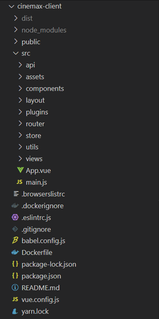

### Vista de Proceso

#### Diagramas de estados
El siguiente diagrama de estados muestra el flujo que seguir un asiento durante la venta de los boletos para una función en particular. 

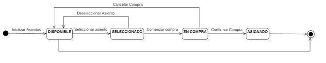

Como se puede observar, inicialmente todos los asientos tienen el status DISPONIBLE. Cuando se selecciona un asiento que está DISPONIBLE, se pasa al estado SELECCIONADO, donde después de un periodo de tiempo, o por elección del usuario, es posible regresar al status DISPONIBLE. Estando en el status SELECCIONADO, un usuario puede iniciar el periodo de compra (EN COMPRA), en el que se puede confirmar la compra (pasando al status ASIGNADO), o cancelar la compra, ya sea de forma manual o al pasar cierto periodo de tiempo.

###	Vista física

La vista física se compone de los elementos físicos y de red que integran al sistema. En este caso, se trata de una nube en AWS con la siguiente arquitectura:

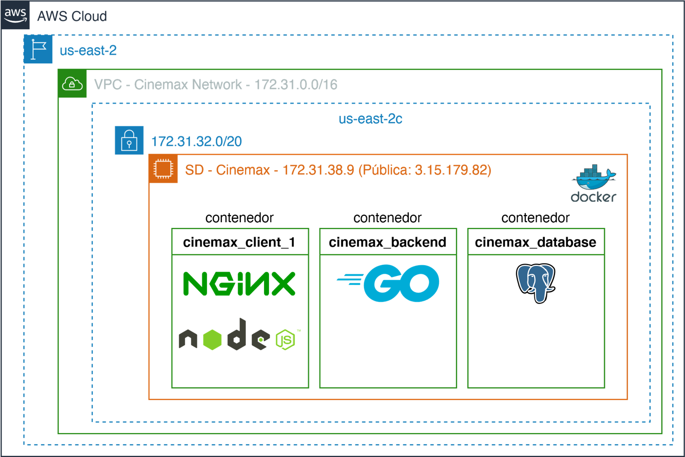


###	Escenarios
Esta vista describe los casos de uso de la aplicación, mismos que corresponden con la capa de aplicación de la arquitectura hexagonal arriba descrita, lo que implica que cada caso de uso será un método de la interfaz.

####	Casos de Uso
Por simplicidad y legibilidad, los diagramas de casos de uso se dividen en módulos que realizan tareas afines dentro del mismo sistema, siguiendo un diseño orientado al dominio (DDD).

### Implementación de las transacciones
A diferencias de frameworks como Spring Boot, o Django que proveen mediante anotaciones o decoradores el control transaccional de algún método a la base datos, Go deja totalmente al programador la tarea de crear y confirmar o abortar transacciones. Por lo que facilitar el trabajo se utilizó la siguiente interfaz que define los métodos implementados tanto por una conexión “normal” a la base de datos, como por una “transacción”, permitiendo con ello implementar una función capaz de crear una nueva transacción y envolver en ella a las funciones que se ejecuten dentro de ella:

```go
type querier interface {
  Get(dest interface{}, query string, args ...interface{}) error
  Select(dest interface{}, query string, args ...interface{}) error
  SelectContext(ctx context.Context, dest interface{}, query string, args ...interface{}) error
  GetContext(ctx context.Context, dest interface{}, query string, args ...interface{}) error
  ExecContext(ctx context.Context, query string, args ...interface{}) (sql.Result, error)
}

type repository struct {
  db querier
}

func (r repository) Transaction(ctx context.Context, txFn ports.TxFn) error {
  tx, _ := r.db.(*sqlx.DB).Beginx()
  r.db = tx
  err := txFn(ctx, &r)
  if err != nil {
    if tx.Rollback() != nil {
      return fmt.Errorf("failed to execute transaction, %w", err)
    }
    return err
  }
  if tx.Commit() != nil {
    return fmt.Errorf("failed to commit transaction, %w", err)
  }
  return nil
}

```

El código anterior permite que cuando se llame al método Transaction, se cree una nueva transacción capaz de hacer commit o rollback dependiendo de si ocurrió un error al ejecutar la función que recibe como parámetro.

### Control de concurrencia
La parte medular de la implementación del sistema yace en cómo se implementa el control de concurrencia para la asignación de asientos y venta de boletos. Tomando como base el diagrama de estados que modela el comportamiento de un asiento se tiene que: inicialmente todos los asientos mantienen su status como DISPONIBLE, y a partir de este se puede pasar a estar al estado SELECCIONADO. Estando en el estado SELECCIOANDO, puede ocurrir que, por alguna falla eléctrica, e incluso por error humano, la transacción no se complete ni se cancele, dejando a la base de datos en un estado inconsistente que provoque que no se puedan asignar asientos que evidentemente están disponibles. 


Para solucionar este problema se propone un enfoque por marcas de tiempo en el que se registre la última actualización de la transacción en curso, donde pasado un minuto de la última modificación de la transacción (tiempo del que no debería exceder una venta de boletos), aunque el status registrado en la base de datos sea SELECCIONADO, el status a nivel lógico sea DISPONIBLE. Lo mismo ocurre para los asientos con el status EN COMPRA, donde por motivos quizá de una tarjeta que no fue aprobada una transacción no se puede completar en el tiempo previsto.

A nivel SQL, la consulta que permite implementar este enfoque es la siguiente:

```sql
SELECT CASE
      WHEN "AS"."STATUS_ASIENTO_ID" = 1 OR (EXTRACT(EPOCH FROM NOW() - "T"."UPDATED_AT")/60 >= 1 AND "AS"."STATUS_ASIENTO_ID" IN (2, 3)) THEN 'DISPONIBLE'
      ELSE "S"."CLAVE"
    END AS "status"
    FROM "ASIGNACION_ASIENTO" AS "AS"
      JOIN STATUS_ASIGNACION_ASIENTO "S" ON "AS"."STATUS_ASIGNACION_ASIENTO_ID" = "S"."STATUS_ASIGNACION_ASIENTO_ID"
      LEFT JOIN "TRANSACCION" AS "T" ON "AS"."TRANSACCION_ID" = "T"."TRANSACCION_ID"
    WHERE "ASIGNACION_ASIENTO_ID" = $1
```

A nivel de aplicación el esquema para manejar la concurrencia se describe en las siguientes líneas de código. En los comentarios de estas se describe el flujo del programa. Es importante recordar que por la forma en que se definió la función envolvente Transaction, al generarse un solo error se realizara rollback de todas las instrucciones DML ejecutadas. 

```go
func (s *service) SeleccionarAsiento(ctx context.Context, asientoId string, transaccionId *string) error {
  return s.r.Transaction(ctx, func(c context.Context, r ports.Repository) error {
    // Se verifica que el asiento exista
    a, err := r.GetAsientoByID(ctx, asientoId)
    if err != nil {
      return err
    }
    // Se verifica que el asiento esté disponible
    ok := r.DisponibilidadAsiento(ctx, a)
    if !ok {
      return &domain.Error{
        Type:    domain.Conflict,
        Message: "El asiento ya no se encuentra disponible",
      }
    }
    // si transaccionId esta vacío, se crea una nueva transacción, si no,
    // se verifica que la transacción exista y además aún este vigente
    if *transaccionId == "" {
      *transaccionId, err = r.GetNewTransactionID(ctx)
      if err != nil {
        return err
      }
    } else {
      err = r.ValidarTransaccion(ctx, *transaccionId)
      if err != nil {
        return err
      }
    }

    // Se actualiza y transaccionId del asiento
    a.StatusAsiento = "2" // 'SELECCIONADO'
    a.TransaccionId = *transaccionId

    // Se actualiza el estado del asiento en la BD
    err = r.UpdateStatusAsiento(ctx, a)
    if err != nil {
      return err
    }
    // Se actualiza el tiempo de la última modificación de la transacción
    return r.UpdateTimeTransaction(ctx, *transaccionId)
  })
}
```

### Control del problema lost update

Para solucionar de forma sencilla el problema de las transacciones que modifican de forma concurrente un registro se propone un enfoque optimista basado en las versiones de las marcas de tiempo, donde un registro solo se puede modificar si su última versión o actualización corresponde con la que se obtuvo al momento de consultar el estado del registro evitando así que, por ejemplo, al seleccionar un asiento, dos transacciones se queden con la idea de que modificaron reservaron el asiento, puesto que actualizarse el estado del asiento, también cambia su marca de tiempo, invalidando así el resto de modificaciones.

```go
func (r *repository) UpdateStatusAsiento(ctx context.Context, a *domain.AsignacionAsiento) error {
  query := `
    UPDATE "ASIGNACION_ASIENTO" SET 
        "STATUS_ASIENTO_ID" = $1, 
        "TRANSACCION_ID" = $2, 
        "UPDATED_AT" = NOW()
    WHERE "ASIGNACION_ASIENTO_ID" = $3 AND "UPDATED_AT" = $4
  `
  result, err := r.db.ExecContext(ctx, query, a.StatusAsiento, a.TransaccionId, a.ID, a.UpdatedAt)
  if err != nil {
    return domain.NewInternal()
  }
  if rows, _ := result.RowsAffected(); rows != 1 {
    return &domain.Error{
      Type:    domain.Conflict,
      Message: "El asiento ya no se encuentra disponible",
    }
  }
  return nil
}
```

## Implementación

### 5.1	Instalación del Sistema

- **Requerimientos de instalación**
El sistema se encuentra empaquetado dentro contenedores Docker que se pueden gestionar haciendo uso de Docker Compose. Se requiere por tanto tener instalada la versión más reciente de Docker y Docker Compose.

- **Proceso de instalación:**

1.	Descargar o clonar el siguiente repositorio de GitHub: https://github.com/jorge-jcc/Cinemax.git	

2.	Una vez instalado Docker y Docker Compose, dentro de la carpeta cinemax ejecutar el comando `docker-compose up`.

3.	Si se está ejecutando de forma local, abrir el navegador y colocar en la barra de direcciones localhost, o bien la dirección IP correspondiente a la máquina que está ejecutando los contendores.

### Ejemplo de uso del sistema

Debido a que se montó el sistema sobre una instancia EC2 de AWS, es posible seguir cada uno de los pasos introduciendo la siguiente dirección: http://ec2-18-219-182-3.us-east-2.compute.amazonaws.com/

La primera pantalla que se muestra corresponde con el login de la aplicación. 

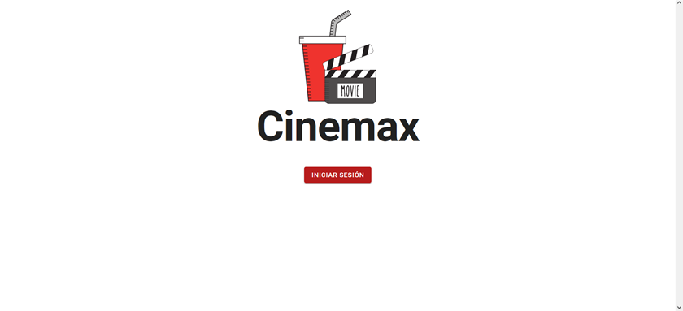

Las credenciales de acceso para probar el sistema son:
- **Usuario:** empleado1@test.com
- **Contraseña**: test_123

Al iniciar sesión como empleado, la primera pantalla visible corresponde a la sección de taquilla:

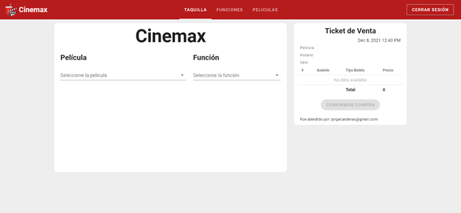

Para poder realizar el proceso de venta de boletos, es necesario primero registrar una película y posteriormente una función para dicha película, para ello, desde el App Bar seleccionar PELICULAS:

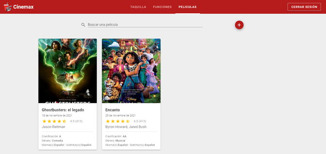

Y posteriormente dar click en el botón +, donde se podrán introducir los datos necesarios para registrar una película:

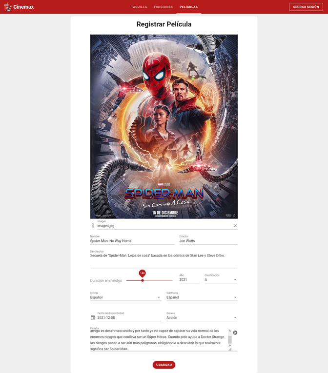

Al hacer click en Guardar, se registrará la película en la base de datos y la pagina nos redirigirá a la pestaña de películas, donde podremos confirmar que la película se guardó exitosamente:

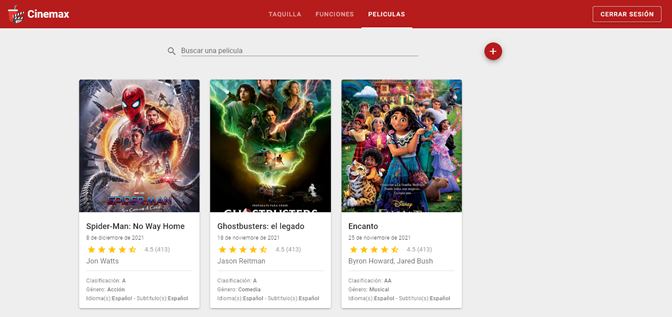

Para poder ver la cartelera del día se debe navegar hasta el menú Funciones.

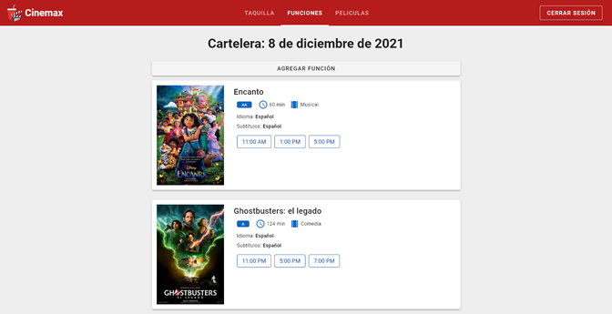

Aquí es posible crear nuevas funciones para las películas ya registradas dando click en el botón Agregar Función y completando el formulario. Vale la pena destacar que, según la lógica de negocios, solo se muestran las salas que están disponibles de acuerdo con el horario y duración de la película.

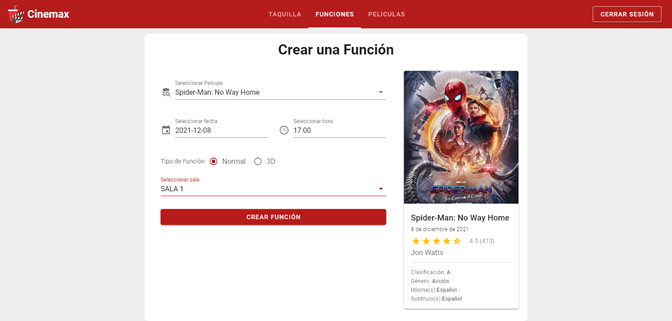

Al hacer click en crear función la pagina nos redirigira a la vista anterior, donde se podra encontrar la nueva funcion creada:

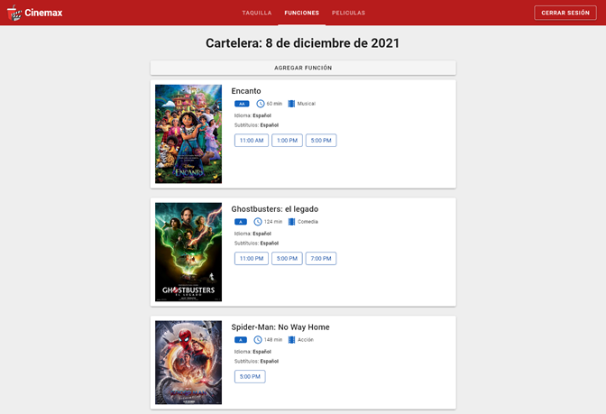


Para poder demostrar el manejo transaccional del sistema implementado, se utilizará otra sesión, cuyas credenciales de acceso son:

- **Usuario:** empleado2@test.com
- **Contraseña:** test_123

Dentro del menú Taquilla es posible elegir la película a la que un cliente desea comprar los boletos, así como su función:

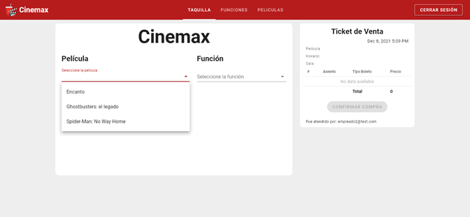

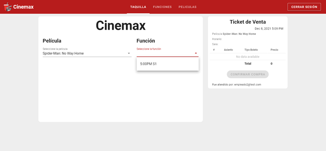

Al seleccionar tanto la película como la función se muestra en pantalla un listado con los asientos disponibles con el siguiente código de colores:

- **Azul:** disponible
- **Amarillo:** seleccionado
- **Rojo:** ocupado

Una vez que se elige un asiento, el empleado puede seleccionar el tipo de boleto con que se asociará. Al hacer esto, de manera reactiva se calcula el nuevo precio del boleto y total de la venta.

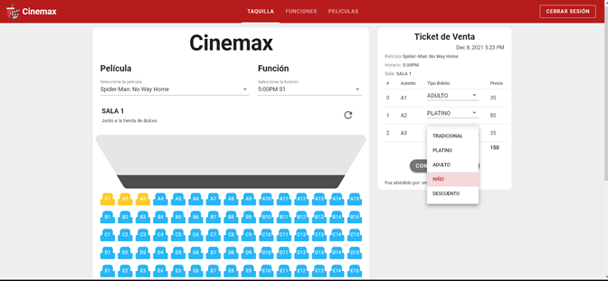

Finalmente, para completar la transacción, el empleado debe presionar el botón confirmar compra y elegir el método de pago.

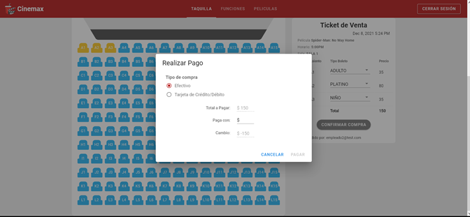

Al concluir la compra, la transacción se cerrará y los asientos se actualizarán con un color rojo para poder seguir vendiendo boletos.

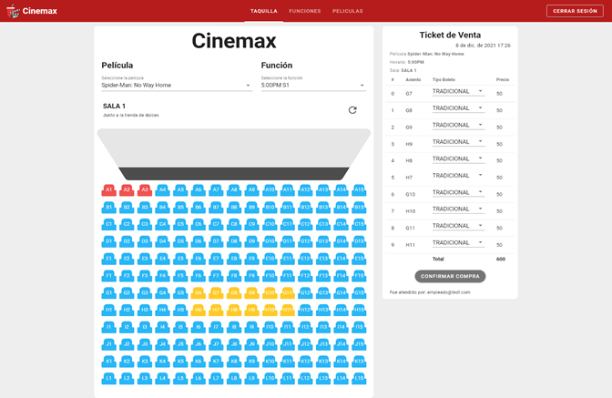
